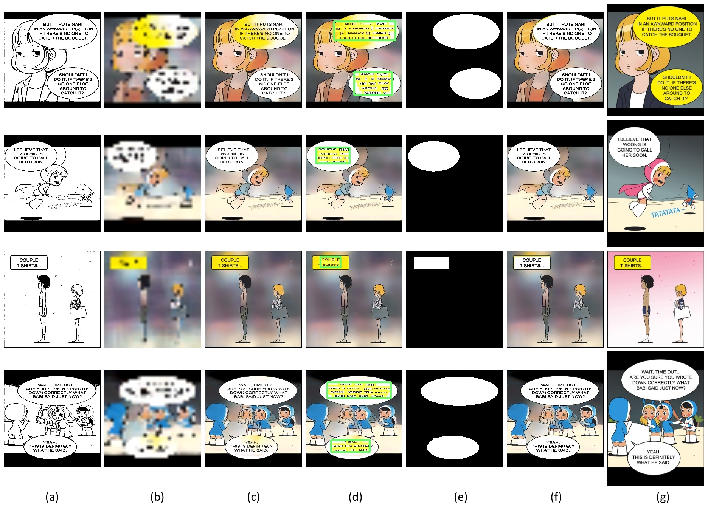
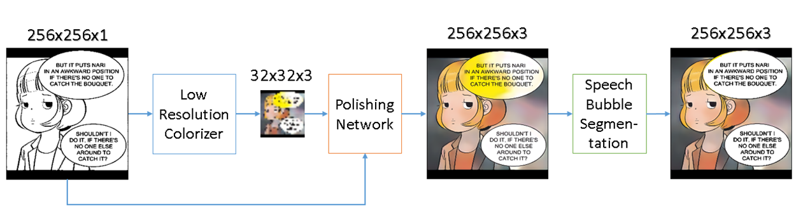
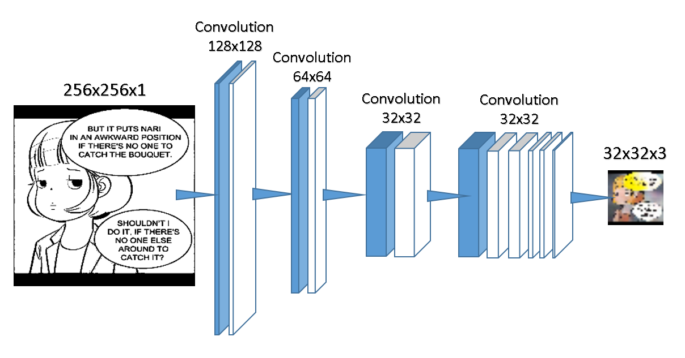
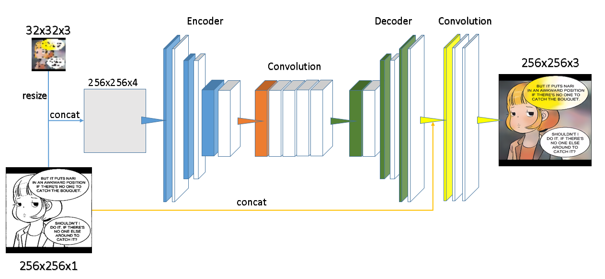
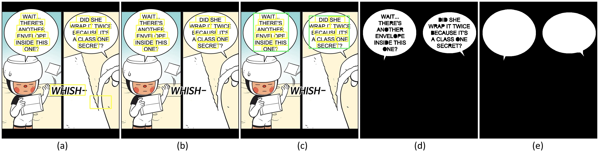
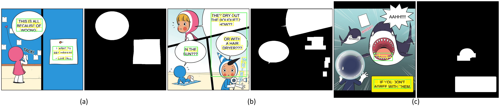
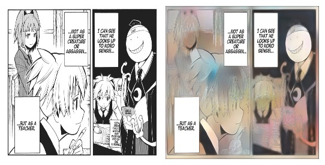

# Speech-Bubble-Aware-Automatic-Comic-Colorization
Speech bubble aware automatic comic colorization using ConvNet. Please see [Report](./Final_report.pdf) for more details.

### Result on validation data


(a) Input gray-scale image, (b) Low-resolution colorized image, (c) Super-resolution color image, (d) Text detection, (e) Speech bubble segmentation, (f) Speech bubble aware colorization, (g) ground truth. Notice the difference in (c) and (f), without speech bubble awareness the colorization is likely to fail in speech bubble regions.

## Usage
### Required package
1. tensorflow (2.0.0a0), GPU version can also be used
2. opencv (4.1.0.25)
3. imutils (0.5.2)
4. beautifulsoup4 (4.7.1), can be skipped if you do not want to crawl the dataset

### Installation
```bash
pip install -r requirements.txt
```

### Reproduce examples
Run `run_example.py` to produce all results.

### Model weights
Pre-trained model weights can be download [here](https://drive.google.com/file/d/13MbuQ2isqSy2dNWCTwrn97FmX7W5TA6q/)

### Dataset
The dataset and preprocess methods we used is the same as [Sungmin Kang's paper](https://nips2017creativity.github.io/doc/Consistent_Comic_Colorization.pdf). The dataset we used is the comic *Yumi's Cell* (English version), from the first episode to episode 238. It can be viewed [here](https://www.webtoons.com/en/romance/yumi-cell/list?title_no=478). Since all the images are under the copyright of the artist Donggeon Lee, and we are unable to contact the artist. Please inform us if there is any copyright issues. 

## System pipeline

Our method consists of three parts, low resolution colorizer, polishing network, and speech bubble segmentation.


### Low resolution colorizer


### Polishing network


### Speech bubble segmentation pipeline


(a) Scene text detection using EAST, (b) Bounding box clustering to eliminate lonely boxes, (c) Cluster the bounding boxes into groups, (d) Flooding filling, (e) Hole filling.

## Failure cases
### Failure cases of speech bubble segmentation

(a) Comic objects containing texts inside, (b) Text cluster too close, (c) Mis-detection result from EAST.

### Generalization to unseen comics and characters


## References
1. Satoshi Iizuka, Edgar Simo-Serra & Hiroshi Ishikawa. (2016) "Let there be Color!: Joint End-to-end Learning of Global and Local Image Priors for Automatic Image Colorization with Simultaneous Classification".

2. Chie Furusawa, Kazutuki Hiroshiba, Keisuke Ogaki & Yuri Odagiri. (2017) "Comicolorization: Semi-Automatic Manga Colorization".

3. Sungmin Kang, Jaegul Choo & Jaehyuk Chang. (2017) "Consistent Comic Colorization with Pixel-wise Background Classification".

4. Sergio Guadarrama, Ryan Dahl, David Bieber, Mohammad Norouzi, Jonathon Shlens, Kevin Murphy. (2017) "PixColor: Pixel Recursive Colorization".

5. Xinyu Zhou, Cong Yao, He Wen, Yuzhi Wang, Shuchang Zhou, Weiran He & Jiajun Liang. (2017) "EAST: An Efficient and Accurate Scene Text Detector".